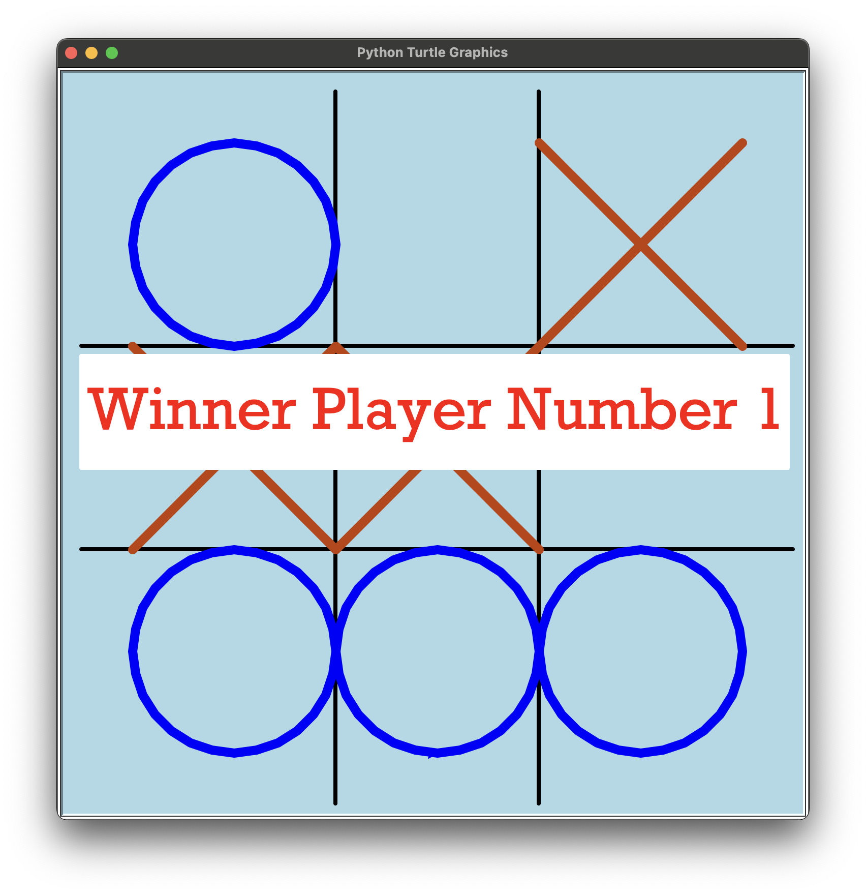
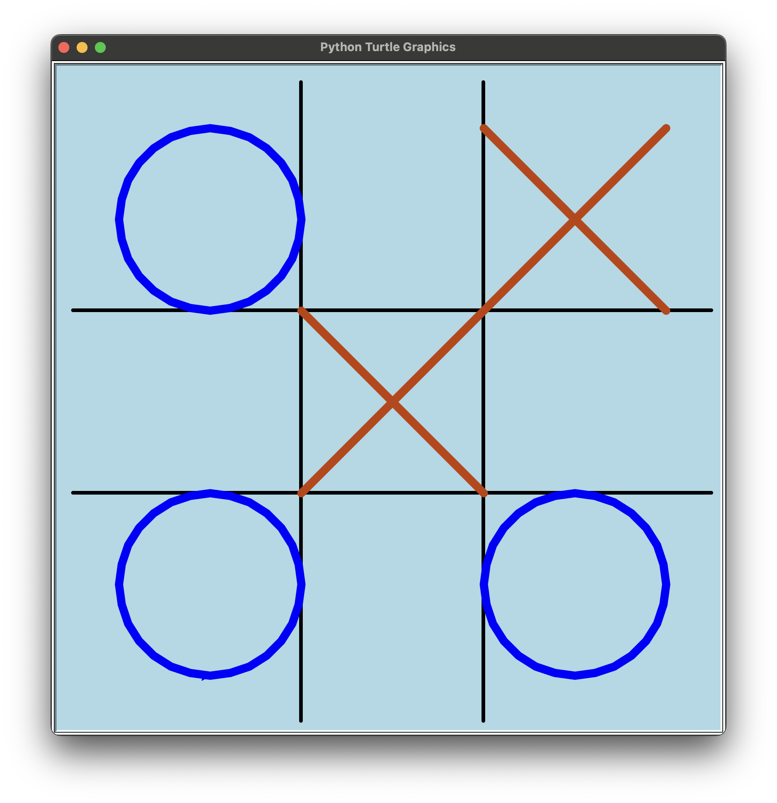

# 🎮 Tic Tac Toe Game (Python Turtle)

This is a **Tic Tac Toe game** built in **Python** using the `turtle` graphics module.  
The game is designed for **two players** and runs on a simple GUI, where one player uses **O (circle)** and the other uses **X (cross)**.

---

## 🚀 Features
- Graphical Tic Tac Toe board using Python Turtle
- Two-player interactive gameplay
- Automatic detection of winner
- Displays winning line when a player wins
- End screen with a winning message

---

## 📝 Rules
- Player 1 → Draws **O** (Blue Circle)  
- Player 2 → Draws **X** (Orange Cross)  
- Players take turns placing their marks on the 3×3 board.  
- The first player to align **three marks in a row (horizontal, vertical, or diagonal)** wins.  
- If the board is full and no one wins → Match is a draw.

---

## 🔑 Important Functions Explained

Here are some of the key functions in the code:

- **`draw_grid()`** → Draws the Tic Tac Toe board (3x3 grid).  
- **`draw_x(x, y)`** → Draws an **X** symbol at the given grid coordinates.  
- **`draw_o(x, y)`** → Draws an **O** symbol at the given grid coordinates.  
- **`check_winner()`** → Checks all possible winning conditions (rows, columns, diagonals) and declares the winner.  
- **`mark_winning_line()`** → Highlights the winning row/column/diagonal with a line.  
- **`display_winner(player)`** → Displays a message like *“Winner Player Number 1”*.  
- **`onclick_handler(x, y)`** → Handles player clicks and places X or O on the correct square.  

---

## 📸 Screenshots

### Game in Progress  

_A game of Tic-Tac-Toe in progress. Player 1 (Blue O) and Player 2 (Orange X) have placed their moves, and the game is ongoing with multiple winning possibilities._

---

### Game Over - Winner Declared  

_The Tic-Tac-Toe game shows the result screen declaring **“Winner Player Number 1”** after Player 1 (Blue O) successfully formed a winning line._

---

## ▶️ How to Run the Game

1. Install Python (>=3.8)  
2. Run the script in terminal/VS Code:  
   ```bash
   python tic_tac_toe.py
